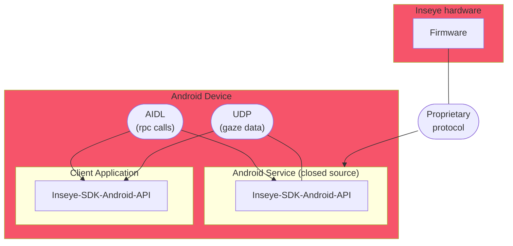

# Solution overview
*created by [Mateusz Chojnowski](mailto:mateusz.chojnowski@inseye.com)*

On Android, Inseye SDK communicates with the eye tracker trough another application, called service, working as a middleman between electronics and user application installed on Android OS.
The service application must be installed on the headset and can be downloaded from the [App Center](https://install.appcenter.ms/orgs/remmed/apps/inseye-service-1/distribution_groups/public).

Client application binds to the Android service on demand.

Communication between the service and client application is done through [ISharedService](./shared-service-interface.md) interface.

Most of the communication is done through synchronous or asynchronous (callback based) RPC calls with the exception of sending gaze and raw data from service to client applications which is made through [UDP sockets](./udp-sockets.md).

Communication flow flowchart.
